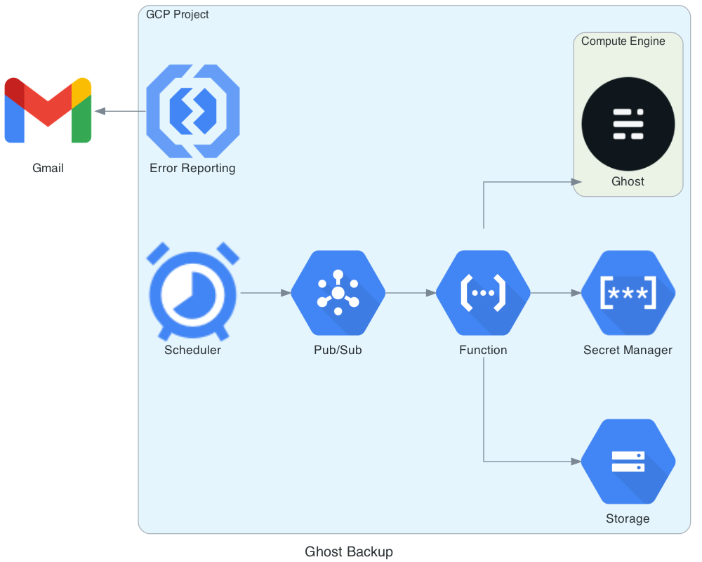

# Ghost Backup Cloud Function

## Deployment Diagram



## Requirements

* Ghost Version: [3.40.5](https://github.com/TryGhost/Ghost/tree/3.40.5)
* GCS access
* Google Secret Manager access
* Cloud Pub/Sub access
* Error Reporting (optional)
* `envvars.yaml` file

```yaml
# envvars.yaml
PROJECT_ID: xxxx-123456 # GCP project ID
SECRET_NAME: xxxxx # For the Ghost user password stored in Google Secret Manager
GHOST_USERNAME: hoge@xxx.com # The Ghost user email address as which backups requests are made
BACKUP_BUCKET_NAME: xxxx-ghost-backup # The name of the GCS bucket in which backups will be saved
ORIGIN: https://bar.com # Jusy for a cookie
GHOST_BASE_URL: https://buzz.com # Your Ghost page's base URL
```

## How to Deploy

```bash
gcloud functions deploy backup_ghost \       
--runtime python39 \
--trigger-topic backup_ghost \
--env-vars-file envvars.yaml
```
